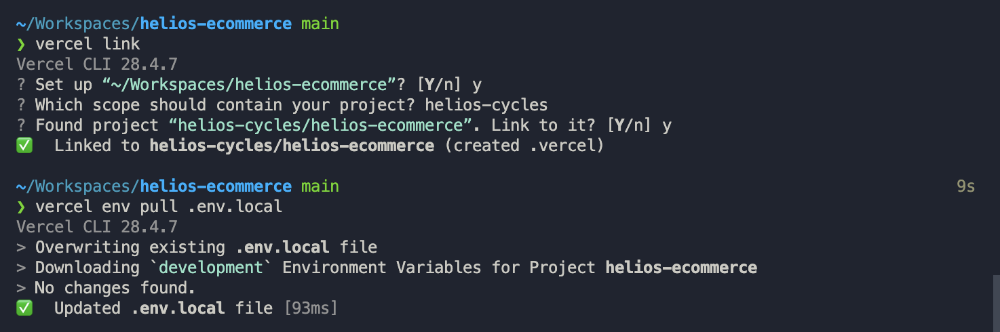

> # OUTDATED (11-27-22)

# Helios Ecommerce

---

## Tech Stack

- [Next.js 12](https://nextjs.org/docs) - Full Stack Web Framework
- [Chakra UI](https://chakra-ui.com/docs/components) - UI Components
  - [React Icons](https://chakra-ui.com/docs/components/icon/usage#using-a-third-party-icon-library) - Additional icons for UI
- [Apollo Client](https://www.apollographql.com/docs/react/) - GraphQL client for [Shopify Storefront API](https://shopify.dev/api/storefront)
- [React Hook Form](https://react-hook-form.com/get-started) Form library

### Development Technology

- Prettier, ESLint, Husky, and Lint Staged
- [GraphQL Code Generator](https://www.the-guild.dev/graphql/codegen) for generating queries from `.gql` files.

---

## Path Aliasing

The project has a few alases written in [`tsconfig.json`](/tsconfig.json)

```json
{
  "@/lib/*": ["lib/*"],
  "@/components/*": ["components/*"],
  "@/graphql/shopify": ["graphql/shopify/generated/types.ts"],
  "@/graphql/contentful": ["graphql/contentful/generated/types.ts"]
}
```

Example Usage

```js
import { WhateverDocument } from '@/graphql';
import apollo from '@/lib/clients/apollo';
import Navbar from '@/components/Navbar';
```

---

## Creating Queries

- Create a `*.gql` file in [`/graphql/<api>/queries`](/graphql/queries) (kebab-case).
- Write up query according to spec, including [Query Name](https://graphql.org/learn/queries/#operation-name) (which is used by code generator)
- Include `@api(name: "<api>")` directive in query to tell Apollo which API to target.

```graphql
# ./graphql/shopify/queries/shop-name.gql
query ShopName @api(name: "shopify") {
  shop {
    name
  }
}
```

- Use `pnpm codegen` or have the dev server running (`pnpm dev`) to generate exports within [`/graphql/generated/graphql.ts`](/graphql/generated/graphql.ts)
- Import the generated query's Document and use with `apollo.client` or with the `useQuery` hook from Apollo Client.

```ts
import { ShopNameDocument } from '@/graphql/shopify';
import { useQuery } from '@apollo/client';

// Inside function component...
const { data, loading, error } = useQuery(ShopNameDocument);
```

```ts
import { ShopNameDocument } from '@/graphql/shopify';
import apollo from '@/lib/clients/apollo';

// Inside `getServerSideProps`
const { data, error } = apollo.query({
  query: ShopNameDocument
});
// Note: `data` is typed!
```

---

## Dev Environment Setup

### Requirements

- Node v16 LTS
- `pnpm@latest` for Package Management.

### Steps

- Clone repository
- Hook up Vercel project to local codebase via `vercel link`, and pull environment variables via `vercel env pull .env.local`



- Run `pnpm install` to install dependencies.
- Use `pnpm dev` to start dev server (Next Dev Server and GraphQL codegen watching).
- `pnpm codegen` to manually generate GraphQL types/queries.
  - Install recommended GraphQL extension to allow for autocomplete when authoring queries.
    - If the GraphQL Language Server throws an error, try reloading the plugin
      with the `VSCode GraphQL: Manual Restart` command, or open the `generated/schema.graphql`
- Use `pnpm lint` to run linter/formatter.
  - `lint-staged` will handle linting on commit.
